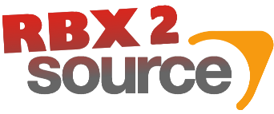

# 
## Port Roblox models to Source Engine Games
    
Originally developed by [MaximumADHD](https://github.com/MaximumADHD), this project serves as a continuation of the original [Rbx2Source](https://github.com/MaximumADHD/Rbx2Source) Project. So far, we've gotten the program to open and it compiles. Model doesn't seem to compile completely as of right now but hopefully it will be fixed soon

# Known Bugs
- Model may appear as error sometimes
- Missing textures on some head accessories when exporting to Source Filmmaker
- Model does not load in Garry's Mod at all
